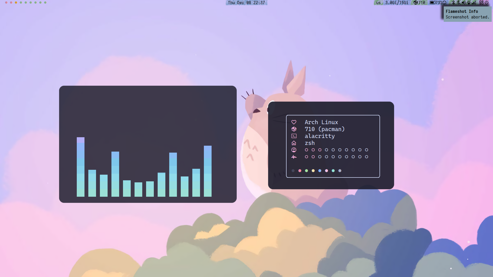
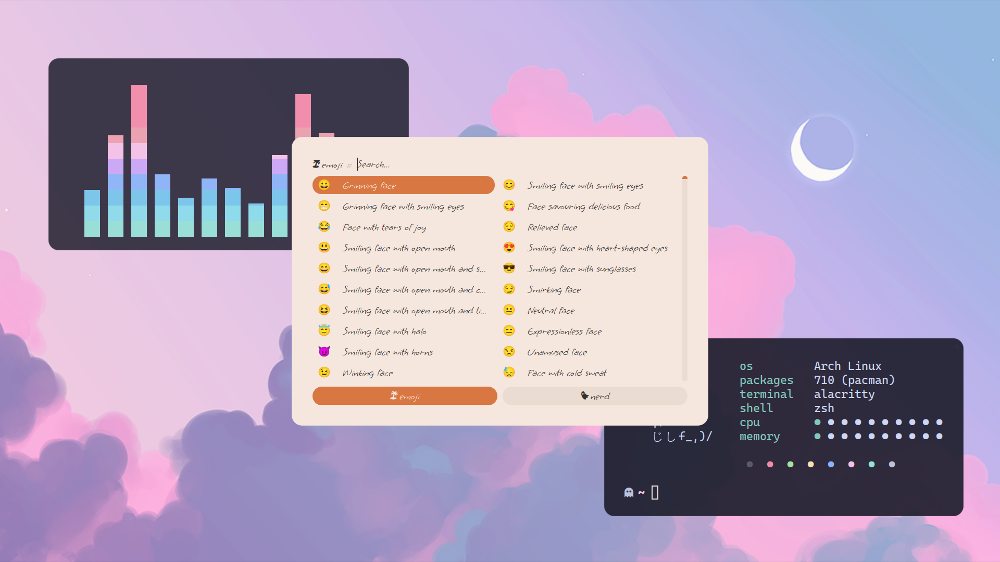
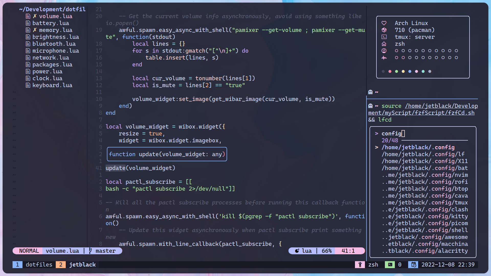

# My dotfile and scripts
My lightweight Arch linux daily drive which highly focus on the terminal and looks smooth. Along with some useful scripts.

## Software I use and configuration
* GUI:
  * [alacritty](https://github.com/GrenicMars/dotfiles/tree/master/config/alacritty)
  * [awesomewm](https://github.com/GrenicMars/dotfiles/tree/master/config/awesome): with a lot of customization to speed up my workflow 
  * [rofi](https://github.com/GrenicMars/dotfiles/tree/master/config/rofi): with custom scripts to select emoji and nerd font icons and more
  * [picom](https://github.com/GrenicMars/dotfiles/tree/master/config/picom): pijulius fork with smooth animation config
* CLI:
  * [nvim](https://github.com/GrenicMars/dotfiles/tree/master/config/nvim): with full lua config and lsp and code snippet(cmp) support
  * [zsh](https://github.com/GrenicMars/dotfiles/tree/master/config/shell/zsh): lightweight and fast without stuff like oh-my-zsh
  * fzf: custom scripts to quickly jump to directories or open files that I use most 
  * [tmux](https://github.com/GrenicMars/dotfiles/tree/master/config/tmux): with vim feeling
  * [lf](https://github.com/GrenicMars/dotfiles/tree/master/config/lf): with image preview, video thumbnail support
  * [macchina](https://github.com/GrenicMars/dotfiles/tree/master/config/macchina): with some beautiful themes
* Themes: [catppuccin](https://github.com/catppuccin/catppuccin) 
* Fonts: [CaskaydiaCove Nerd Font](https://github.com/eliheuer/caskaydia-cove)

I didn't list all the software whose config files inclued in this repo because I didn't do too much things to them or they are not that interenting, check those files yourself to see if they are interenting to you anyway.

## Installation
Clone this repo and pick up which configuration you want to use into your own file, you should know what you doing at this point.

## Things that not finish yet
* awesomewm bluetooth and network wibar widgets
* rofi email widget
