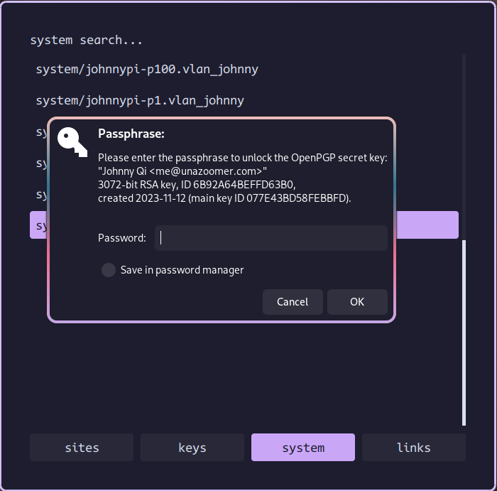
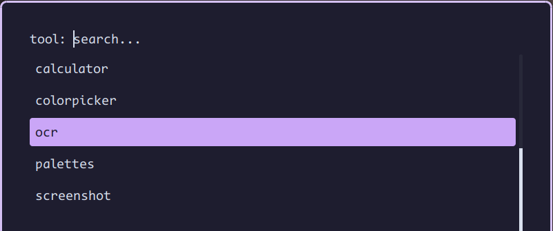
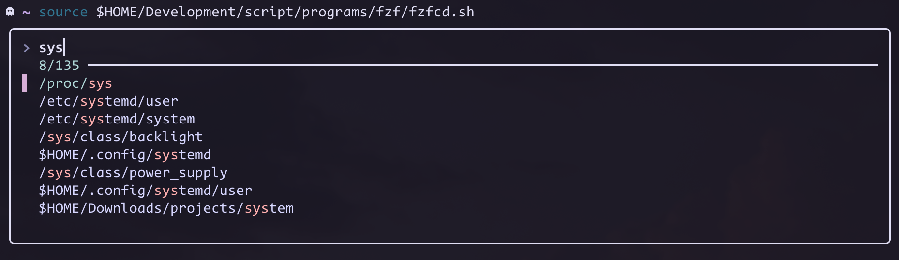
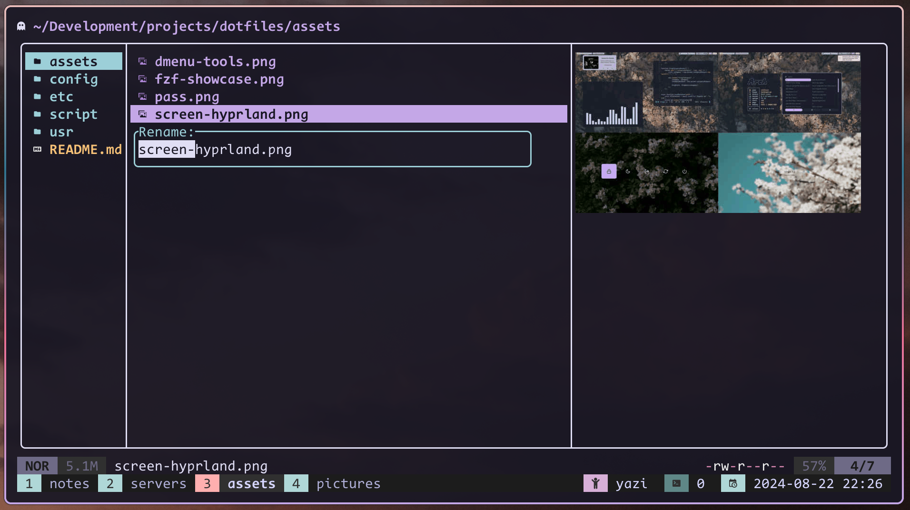

# Personal desktop configuration files and scripts
This is a collection of configuration files and scripts that I use on my Arch Linux daily driver desktop. Currently it's built around the Wayland ecosystem and makes extensive use of systemd for managing graphical services, as well as networking and boot configurations.

I’ve included all the dotfiles for programs I’ve customized in this repository, even those I no longer use or maintain, such as programs exclusive to the Xorg environment. Regardless of their maintenance status, you should always review these files carefully before using them on your own machine, especially shell scripts.


## 📦 Programs and Usage
### 🖼️ Wayland Desktop Environment
- **Graphical Daemon Manager**, [Systemd](https://systemd.io): Most of my graphical daemons are managed by Systemd’s built-in user target, `graphical-session.target`. To add more daemons that start after the graphical session, create unit files for those daemons and include the `WantedBy=graphical-session.target` directive under their `[Install]` sections. Then, enable the units with `systemctl --user enable <unit>`.

- **Window Manager**, [Hyprland](https://hyprland.org): I use the [split-monitor-workspaces](https://github.com/Duckonaut/split-monitor-workspaces) plugin to make the multi-head workspace experience similar to the one in Awesome WM. The launcher script at `script/programs/wayland/hyprland/launcher.sh` is a simple shell wrapper that starts Hyprland in integrated, hybrid, or Nvidia graphical mode. However, I no longer use an Nvidia card, so the arguments in this script may be outdated. When starting Hyprland (with or without the script), it pulls in the `hyprland-session.target` unit, which is bound to `graphical-session.target` (i.e., `BindsTo=graphical-session.target`), and the rest of the enabled graphical services start from there.
  * Installation on Arch Linux: `pacman -S hyprland`.
  * Starting Hyprland: Run the `script/programs/wayland/hyprland/launcher.sh [ nvidia | integrated | hybrid ]` script after logging into the virtual console. ⚠️ *Note: The optional argument may be outdated.*
  * Stopping Hyprland and related graphical daemons: Use `systemctl --user stop hyprland.session.target && hyprctl dispatch exit`, which is bound to `Super + Ctrl_R + q` in Hyprland.

- **Status Bar**, [eww-tray-wayland](https://github.com/ralismark/eww): This is a fork of the original eww project with system tray support. My setup is highly integrated with Hyprland and its workspace plugin, making it work well in a multihead environment. The supported widgets include workspace, system tray, system status, mpd music daemon, and more. You can take a look of what's available in the configuration files or in the screenshot above. ⚠ *Note: Currently, the networking indicator only works with Network Manager; support for other tools is in progress.*
  * Installation on Arch Linux (with dependencies for widgets and scripts): `yay -S eww-tray-wayland-git bluez pamixer pamixer gojq-bin jaq socat mpc mpd`.
  * Starting the eww daemon: Enable the `eww-daemon.service` unit, or start it manually with `systemctl --user start eww-daemon.service`.
  * Toggling a specific window: Use `systemctl --user start eww-toggle@<WINDOW_NAME>.service`. For example, to toggle the status bar for the current monitor, you can use the command `systemctl --user start eww-toggle@status_bar_"$(hyprctl -j monitors | jaq -r '.[] | select(.focused == true) | .id')"`. This command is bound to the `Super + b` key in Hyprland.

- **System Idle and Locking Utilities**: [Hyprlock](https://github.com/hyprwm/hyprlock/), [Hypridle](https://github.com/hyprwm/hypridle), and systemd-logind (`loginctl`): There are two user service units available for system locking and idling: `hypridle.service`, which comes with the hypridle package, and a custom service unit, `hypridle-awake.service`. The `hypridle.service` unit reads the default Hypridle configuration from `config/hypr/hypridle.conf`. It first turns off the screen, then locks all user sessions, and finally suspends the system. The `hypridle-awake.service` reads `config/hypr/hypridle-awake.conf` and omits the suspension step, which is useful for keeping certain tasks running without suspending the system (e.g., syncing files).
  * Installation on Arch Linux: `pacman -S hyprlock hypridle`.
  * Start hypridle daemon (with suspension): `systemctl --user start hypridle.service`.
  * Start hypridle daemon (without suspension): `systemctl --user start hypridle-awake.service`. This service conflicts with `hypridle.service`, so there's no need to stop `hypridle.service` first.
  * Lock the screen for all user sessions: Press the `Super + Caps` key in Hyprland or use the `loginctl lock-session` command.

- **Wallpaper and Image Viewer**, [swww](https://github.com/LGFae/swww) and [nsxiv](https://github.com/nsxiv/nsxiv): The swww daemon is configured as a systemd user service unit (`swww-daemon.service`), and nsxiv has several keybindings, including one to change the wallpaper to the currently selected image using swww.
  * Installation on Arch Linux: `pacman -S nsxiv swww`.
  * Start the swww daemon: `systemctl --user start swww-daemon.service`.
  * Set a random image from `$HOME/Resources/media/pictures/wallpaper/landscape` as the wallpaper: Press the `Super + -` key in Hyprland.
  * View wallpaper images in the `$HOME/Resources/media/pictures/wallpaper/landscape` directory: Press the `Super + Shift + w` key in Hyprland.

- **Terminal Emulator**, [foot](https://codeberg.org/dnkl/foot): Foot is a terminal emulator built specifically for Wayland. It supports a client-server mode, which is much more responsive than normal ones, I can spawn multiple terminal windows at once without noticing any laggy animations.
  * Installation on Arch Linux: `pacman -S foot`.
  - Starts the daemon: `systemctl --user start foot-server.socket`. 
  - Spawns a footclient: `footclient`, this command is bind to the `Suprt + Enter` key in Hyprland. 

* **Notification Daemon**, [dunst](https://dunst-project.org/): I haven’t done much configuration for this program, except for customizing the color schemes and icons. However many scripts and utilities optionally depend on it.
  * Installation on Arch Linux: `pacman -S dunst`.
  - Starts the daemon: `systemctl --user start dunst.service`. 

### 🖥️ General Graphical Utilities
These are small graphical tools that you might find useful. They don't depend on Wayland and can be integrated into other desktop environments.
- [rofi](https://github.com/davatorium/rofi): The original rofi project, which works well under XWayland. My setup is heavily inspired by [adi1090x's rofi project](https://github.com/adi1090x/rofi). It includes several windows for various utilities, such as:
  * **Program Launcher, Emoji Picker, and Nerd Font Icon Selector**: You can bring it up by pressing the `Super + r` key in Hyprland, or by running the script directly. For example, `config/rofi/launcher.sh catppuccin "CodeNewRoman Nerd Font" 15`.
  * **Copy Decrypted Password from [pass](https://www.passwordstore.org/)'s Passstore**: You can bring up the window by pressing the `Super + [` key or by executing the `config/rofi/powermenu.sh [ THEME ]` script (e.g., `config/rofi/powermenu.sh catppuccin`).

    

  * **Collection of Small Tools**: Includes utilities like [rofi calculator](https://github.com/svenstaro/rofi-calc), [color picker](https://github.com/hyprwm/hyprpicker), [OCR](https://github.com/tesseract-ocr/tesseract), and more. You can bring it up by pressing the `Super + ]` key or by executing the `config/rofi/dmenu-toolbox.sh [THEME] [FONT] [FONT_SIZE]` script.

    

  To use my rofi setup without modification, the following dependencies are required:
  * Packages: `gnupg`, `pass`, `gcr`, `rofi`, `dunst`, `rofi-calc`, `tesseract`, `gcolor3`, `grimblast`.
  * Fonts: Any font with nerd font icons should suffice. The font and font size can be specified as the second and third argument (e.g., `config/rofi/launcher.sh catppuccin "CodeNewRoman Nerd Font" 15`).

### ☕ Command Line Utilities
- **Text Editor**, [neovim](https://neovim.io/): Full Lua configurations with LSP supports for programming languages I use. 

- **Shell**, [zsh](https://www.zsh.org/): Equipped with plugins such as syntax highlighting, autosuggestions, and better tab completion, without relying on a framework (e.g., on-my-zsh).

- **Fuzzy Finder**, [fzf](https://github.com/junegunn/fzf): Highly integrated with my zsh configuration, with a nice layout and color scheme. Source the scripts `script/programs/fzf/fzfcd.sh` and `script/programs/fzf/fzfopen.sh` to quickly cd into directoies or open configured files.
  

- **Terminal Multiplexer**, [tmux](https://github.com/tmux/tmux): Common configurations with vim-like keybindings, the [vim tmux navigator plugin](https://github.com/christoomey/vim-tmux-navigator) provides a nice way to navigate between vim and tmux panels.

- **Terminal File Manager**, [yazi](https://yazi-rs.github.io/): A terminal file manager written in Rust with built-in support for image and media previews. This replaces lf, which requires more effort to configure preview features. However yazi might not be suitable and available for server environments.
  

### ⚒ System Management
- **Network Management Utilities**: Systemd-networkd, systemd-resolved, and wpa_supplicant for Wireless network.

- **Boot loader**: Systemd-boot.

- **Disk encryption**: Full disk encryption with LUKS format. 

### 🚫 Deprecated configurations
These are programs that I have configured but no longer use or maintain. While they might still work, it's recommended to use them with caution and perform necessary adjustments.

#### Wayland environment
- System Idle and Locking, [swayidle](https://github.com/swaywm/swayidle) and [swaylock](https://github.com/swaywm/swaylock): Replaced by hyprlock and hypridle. 

- Terminal Emulator, [alacritty](https://alacritty.org/): Replaced by the foot terminal.

#### X11 Environment
- Window Manager, [AwesomeWM](https://awesomewm.org/).

- Window compositor, [Picom (dccsillag's fork)](https://github.com/GrenicMars/dotfiles/blob/master/config/picom/picom.conf). 

- Screen locking utility, [betterlockscreen](https://github.com/betterlockscreen/betterlockscreen).

#### Command line
- File Maanger, [lf](): Replaced by yazi. Although it still works well on Wayland, using the [ueberzugpp fork](https://github.com/jstkdng/ueberzugpp).

## ⚙️ Installation
Currently, there isn't a well-tested installation script for this setup. Because of this, use caution when applying these configurations to your system. It's recommended to manually review each configuration file to ensure it fits your environment and needs.

To get started, you can clone this repo, from there you can manually copy or symlink the configuration files you want to use. Remember to back up your existing configuration files before making any changes. For example to use my yazi configuration:
```
$ git clone https://github.com/jetblack0/dotfiles johndot
$ cd johndot
$ [ -d ~/.config/yazi ] && mv ~/.config/yazi ~/.config/yazi.bak
$ ln -s "$HOME"/.config/yazi "$(pwd)"/config/yazi 
```

## 🐛 Known issues
- Eww music widget stop working if the music information contains double quote due to incorrect JSON format.

## 🤝 Contributing
If you find any improvements or have suggestions, feel free to open an issue or submit a pull request. Cheers.
